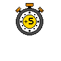
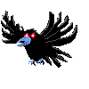
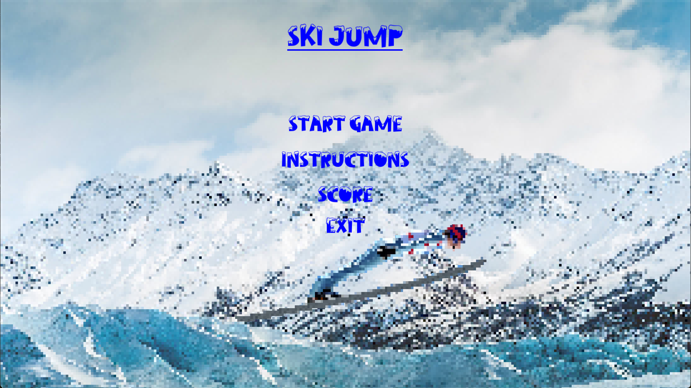
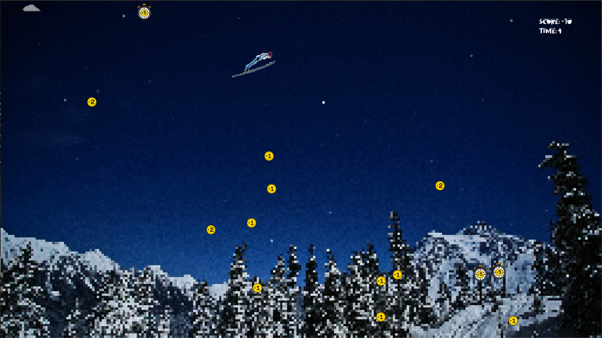
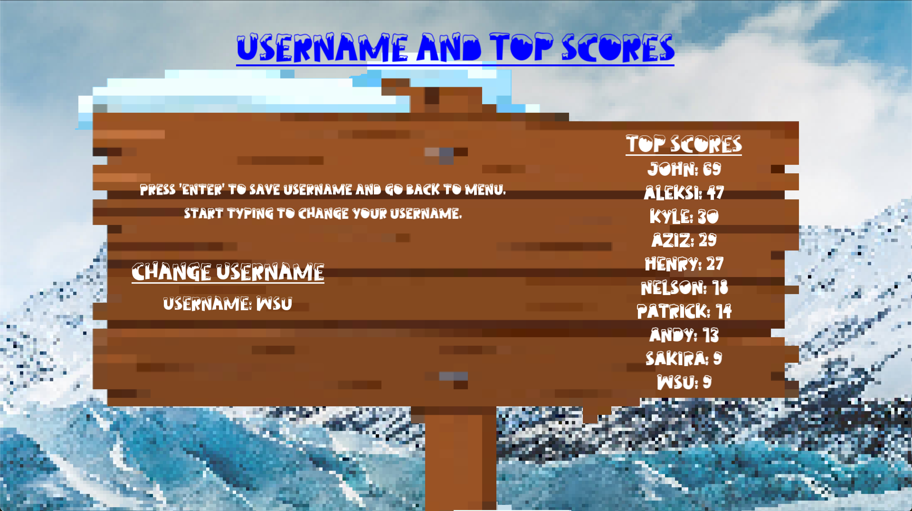

# GameJam 2024 - WSU: Ski Jump

Welcome to our game, created by Kyle Hurd and Abdul Aziz Al-Dalaan for the 2024 WSU GameJam.
For this event, we were given 48 hours to design a game. The theme of the event was: `Frozen`.

`Ski Jump` is the decided game to create. The music and images are handcrafted, with the exceptions of
the background, skier, a single sign, and the sound effects.

## Contributors

- Kyle Hurd
- Abdul Aziz Al-Dalaan

## Mission

After launching off of a ski jump, you must navigate your way through the air, avoiding the shivering
effects of clouds and infamous crows, all the while collecting coins and clocks to maximize your score.


## Icons

| Icon Name | Image | Description |
| --- | --- | --- |
| Coin +1 |  | You gain +1 points |
| Coin +2 |  | You gain +2 points |
| Clock +5 |  | You gain +5 seconds |
| Clock +10 |  | You gain +10 seconds |
| Bird |  | You instantly lose the game |
| Cloud |  | You lose -5 points. You are frozen in place for a duration of time. |

## Video From Game


## Images From Game







## How to Build

Tools required:

- CMake: version 3.26 or higher

In the root of the project, run the following commands.

```sh
cmake -S . -B build
cmake --build build --config Release
```

SFML Should be setup in the cmake build process. Tested on Windows, MacOS, and Linux.